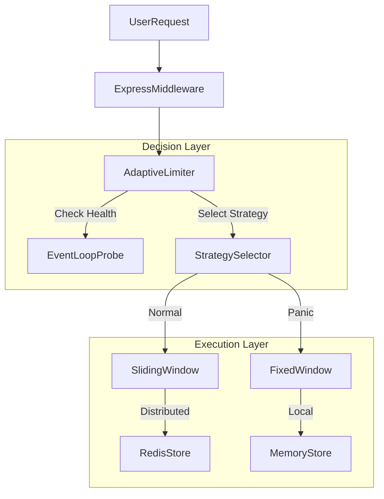

# Limitra

Limitra is a production-grade rate limiter that prioritizes system survival.

Unlike standard limiters that force a static choice (Redis vs. Memory), Limitra allows you to hot-swap strategies based on system load. Switch from accurate-but-expensive Redis algorithms to fast-and-cheap Memory algorithms dynamically when your server is under stress.

## Features

**Adaptive**: Automatically switches strategies based on Event Loop Lag or Redis availability.

**Modular**: Decoupled architecture. Mix and match Algorithms (Sliding, Fixed, Token) with Stores (Redis, Memory).

**Atomic Redis**: Uses custom Lua scripts for race-condition-free distributed limiting.

**Lightweight**: Redis is an optional peer dependency. Zero bloat for memory-only users.

**TypeScript**: Fully typed with modern ESM support.

## Installation

```bash
npm install limitra
```

**Note**: If you plan to use Redis, you must install the client yourself:

```bash
npm install ioredis
```

## Quick Start

Here is the standard setup using the Sliding Window algorithm (Industry Standard) with Redis.

```typescript
import express from "express";
import Redis from "ioredis";
import { 
  createRedisStore, 
  createSlidingWindow, 
  limitra 
} from "limitra";

const app = express();
const redisClient = new Redis();

// 1. Create the Store
const store = createRedisStore(redisClient);

// 2. Create the Limiter (100 requests per minute)
const limiter = createSlidingWindow(store, { 
  points: 100, 
  duration: 60 
});

// 3. Apply Middleware
app.use(limitra({ 
  limiter,
  // Optional: Custom key generator (default is req.ip)
  keyGenerator: (req) => req.user?.id || req.ip 
}));

app.get("/", (req, res) => res.send("Welcome!"));

app.listen(3000);
```

## The Adaptive Limiter (Killer Feature)

This is why you use Limitra. Prevent "Death Spirals" by shedding load cheaply when your server is dying.

**Scenario**:
- **Normal**: Use Redis (Sliding Window) for global consistency.
- **Panic**: If Event Loop Lag > 50ms, switch to Memory (Fixed Window) to save I/O.

```typescript
import { 
  createAdaptiveLimiter, 
  createMemoryStore, 
  createRedisStore,
  createSlidingWindow,
  createFixedWindow,
  measureEventLoopLag,
  limitra
} from "limitra";
import Redis from "ioredis";

// 1. Define Strategies
const redisStore = createRedisStore(new Redis());
const memoryStore = createMemoryStore();

// Accurate but expensive (Network I/O)
const normalStrategy = createSlidingWindow(redisStore, { points: 10, duration: 60 });

// Fast but local (In-Memory)
const panicStrategy = createFixedWindow(memoryStore, { points: 5, duration: 60 });

// 2. Create the Brain
const adaptiveLimiter = createAdaptiveLimiter({
  strategies: {
    "normal": normalStrategy,
    "panic": panicStrategy
  },
  selector: async () => {
    // Check Event Loop Lag
    const lag = await measureEventLoopLag();
    
    // If lag is high, server is struggling. Don't call Redis.
    if (lag > 50) return "panic";
    
    return "normal";
  }
});

// 3. Use it
app.use(limitra({ limiter: adaptiveLimiter }));
```

## API Reference

### 1. Algorithms

Limitra supports three core algorithms. You can use any algorithm with any store.

| Algorithm | Function | Use Case |
|-----------|----------|----------|
| Sliding Window | `createSlidingWindow` | Recommended. Best balance of accuracy and fairness. Prevents "edge" spikes. |
| Fixed Window | `createFixedWindow` | Fastest. Best for "Panic Mode" or simple limits. Resets strictly at time boundaries. |
| Token Bucket | `createTokenBucket` | Bursty Traffic. Allows a burst of requests up to capacity, then refills at a steady rate. |

### 2. Stores

**createMemoryStore()**

Stores data in a JavaScript Map.

- **Pros**: Fastest (~0ms latency). No external dependencies.
- **Cons**: State is local to the process (not shared across a cluster). Data lost on restart.

**createRedisStore(redisClient)**

Requires an ioredis client instance.

- **Pros**: Distributed state (shared limits across multiple servers).
- **Cons**: Adds network latency.
- **Atomicity**: Uses custom Lua scripts to ensure accuracy under high concurrency.

### 3. Middleware Options

The `limitra` function accepts the following options:

```typescript
limitra({
  limiter: RateLimiter; // The instance created via algorithms
  
  // How to identify the user. Default: req.ip
  keyGenerator?: (req: Request) => string;
  
  // Custom error message or object. Default: "Too many requests..."
  message?: string | object;
  
  // HTTP status code. Default: 429
  statusCode?: number;
})
```

## Architecture

Limitra uses a Strategy Pattern to decouple logic from storage.



## Development

To build the project locally or run tests:

```bash
# Install dependencies
npm install

# Build the project (outputs to dist/)
npm run build

# Run the example server
npx tsx examples/express-server.ts
```
